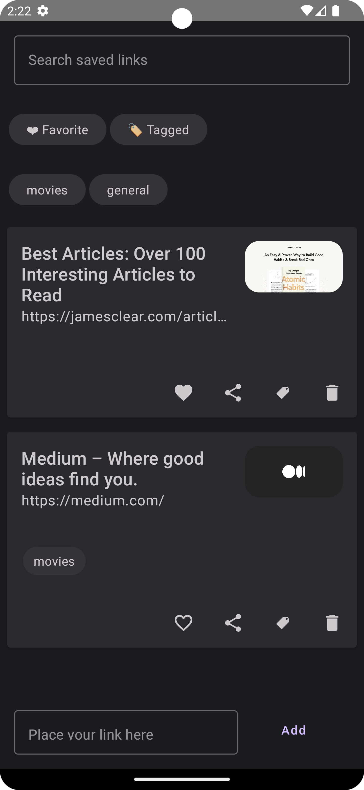
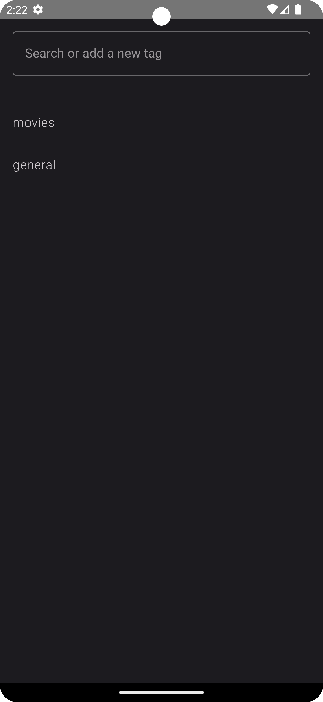

# Belt

Belt is a Link manager App that is inspired
by [Mozilla Pocket](https://www.mozilla.org/en-US/firefox/pocket/).
We are all floating with links that our friends send us, being videos or articles, that we are
either supposed to watch later or read later. Or it could be that the article or the video is just
too good you don't want to let it go. Or it could be that the link is just important as a reference
and you want to keep it forever. Instead of sending yourself private messages with links that are
too chaotic, Belt solves this exact problem: It stores your links in an organised way and in a nice
UI.

# Tech stack

Belt is built with Compose Multiplatform (Mobile), thus it serves as an example if you want to learn
KMM with Compose Multiplatform as well.

Since I am an experienced Android developer, I tried my best to touch the ios code as little as
possible, and it worked pretty smoothly.

My entire experience will be reflected in a Blog Article in the future.

## Libraries:
Realm and Ksoup are the only things that were needed as 3rd party libs. The rest is either jetbrains
or android native libs.

## Features:

- CRUD with Links
- CR with Tags
- Search and filter
- Add to favorites
- Social share with friends

## Features to come:

- Online synchronization (At the moment the app works only offline but internet connection is still
  needed because it needs to parse the HTML of the link to get its' properties)
- Authentication and server hosting
  I would like the links to be stored somewhere on the cloud. Let's see if I find a nice and cheap
  solution to make it online for everyone.
- Add more info to the saved links like date and time of creation or their update.
- Some basic builds using Github actions to insure better continuous development/continuous
  integration
- Empty state screens

# Testing
No tests are written whatsoever. Changes to come in the future, mostly unit tests and screenshot 
testing.

# App Screenshots

 
  
